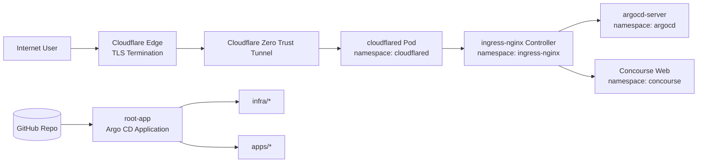

# k8s-home: Home k3s GitOps Platform

このリポジトリは、`k3s + Argo CD + ingress-nginx + cloudflared` で自宅 Kubernetes 基盤を構築するための GitOps 管理リポジトリです。

## Domain Placeholder Note

本READMEに出る `argocd.<YOUR_DOMAIN>` / `concourse.<YOUR_DOMAIN>` / `*.<YOUR_DOMAIN>` はプレースホルダです。**実際の環境に合わせて `<YOUR_DOMAIN>` を必ず置き換えてください。**
このリポジトリの現在の実運用例は `argocd.miruohotspring.net` / `concourse.miruohotspring.net` です。

また Secret の実値は Git に保存せず、`kubectl create secret` もしくは将来的に **SOPS / ExternalSecrets** で管理することを推奨します。

## 1. Architecture Overview (Estimated: 10 min)

### 1.1 System Diagram



### 1.2 App of Apps Pattern

- `bootstrap/root-app/application.yaml` が親 Application (`root-app`)。
- `infra` と `apps` を再帰的に監視し、配下 Application を自動同期。
- 新規アプリは `apps/` または `infra/` に Application を追加するだけで展開可能。

### 1.3 Directory Tree

```text
k8s-home/
├── README.md
├── kustomization.yaml
├── namespaces.yaml
└── bootstrap/
    ├── argocd/
    │   ├── install.yaml
    │   ├── kustomization.yaml
    │   └── namespace.yaml
    └── root-app/
        ├── application.yaml
        └── project-infra.yaml
```

## 2. Prerequisites (Estimated: 10 min)

### Required Conditions

- k3s クラスタが起動済み
- `kubectl`, `helm`, `git` が利用可能
- Cloudflare で対象ドメインを管理済み
- Cloudflare Zero Trust が利用可能

### Commands

```bash
kubectl cluster-info
kubectl get nodes -o wide
kubectl get pods -A
helm version
git --version
```

### Expected Results

- Kubernetes API の接続情報が表示される
- Node が `Ready`
- 既存 Pod 一覧が取得できる
- `helm version`, `git version` が正常表示される

## 3. Step 1: Disable Traefik on k3s (Estimated: 15 min)

> 仕様方針: ingress-nginx を唯一の Ingress Controller として使うため、k3s の Traefik を無効化します。

### Commands

```bash
# k3s server install/config に --disable traefik を指定
# 既存構成の確認
sudo cat /etc/rancher/k3s/config.yaml

# 例: config.yaml
# disable:
#   - traefik

# 反映後に再起動
sudo systemctl restart k3s

# 確認
kubectl get pods -A | grep -i traefik || true
```

### Expected Results

- `config.yaml` に `disable: [traefik]` 相当が入っている
- `kube-system` に Traefik Pod が存在しない
- 以後 Ingress は ingress-nginx 側で処理される

## 4. Step 2: Cloudflare Zero Trust / Tunnel Setup (Estimated: 20 min)

### Actions

1. Cloudflare Dashboard で Zero Trust を有効化
2. Tunnel を 1本作成 (`k8s-home` など)
3. Public Hostname を追加
  - `argocd.<YOUR_DOMAIN>` -> `http://ingress-nginx-controller.ingress-nginx.svc.cluster.local:80`
  - `concourse.<YOUR_DOMAIN>` -> 同上（Host 振り分けは Ingress が担当）

### Tunnel Token Retrieval

- Zero Trust -> Networks -> Tunnels -> 対象 Tunnel
- `cloudflared token <TUNNEL_NAME>` 形式のトークンを取得

### Expected Results

- Public Hostname が 2件以上設定済み
- Token を Kubernetes Secret 化できる状態

## 5. Step 3: Install ingress-nginx with Helm + Argo CD (Estimated: 20 min)

### Argo CD Application Example (infra/ingress-nginx/application.yaml)

```yaml
apiVersion: argoproj.io/v1alpha1
kind: Application
metadata:
  name: ingress-nginx
  namespace: argocd
spec:
  project: infra
  source:
    repoURL: https://kubernetes.github.io/ingress-nginx
    chart: ingress-nginx
    targetRevision: 4.12.0
    helm:
      valueFiles:
        - values.yaml
  destination:
    server: https://kubernetes.default.svc
    namespace: ingress-nginx
  syncPolicy:
    automated:
      prune: true
      selfHeal: true
```

### Actions
```bash
# 1) Argo CD を先に入れる
kubectl apply -k bootstrap/argocd/

# 2) ingress-nginx 用 AppProject を作成
kubectl apply -f bootstrap/root-app/project-infra.yaml

# 3) ingress-nginx Application を作成（Argo CD が Helm でインストール）
kubectl apply -f infra/ingress-nginx/application.yaml
```

### Verification Commands

```bash
kubectl -n ingress-nginx get deploy,svc,pods
kubectl -n ingress-nginx get svc ingress-nginx-controller
kubectl -n argocd get application ingress-nginx
```

### Expected Results

- ingress-nginx controller Pod が `Running`
- `ingress-nginx-controller` Service が作成済み
-  Argo CDの `ingress-nginx` applicationが `Synced` かつ `Healthy`

## 6. Step 4: Create cloudflared Secret (Estimated: 5 min)

### Commands

```bash
kubectl create namespace cloudflared --dry-run=client -o yaml | kubectl apply -f -
kubectl -n cloudflared create secret generic cloudflared-tunnel-token \
  --from-literal=TUNNEL_TOKEN='<CLOUDFLARED_TUNNEL_TOKEN>'

kubectl -n cloudflared get secret cloudflared-tunnel-token
```

### Expected Results

- `secret/cloudflared-tunnel-token created`（または configured）
- `kubectl get secret` で `TYPE: Opaque` が確認できる

### Apply cloudflared via Argo CD

```bash
kubectl -n argocd annotate application root-app argocd.argoproj.io/refresh=hard --overwrite
kubectl -n argocd patch application root-app --type merge -p '{"operation":{"sync":{}}}'

kubectl -n argocd annotate application cloudflared argocd.argoproj.io/refresh=hard --overwrite
kubectl -n argocd patch application cloudflared --type merge -p '{"operation":{"sync":{}}}'
kubectl -n argocd get application cloudflared
kubectl -n cloudflared get pods
```

## 7. Step 5: Argo CD Password (Estimated: 5 min)

### Commands

```bash
# 初期adminパスワード取得
kubectl -n argocd get secret argocd-initial-admin-secret \
  -o jsonpath="{.data.password}" | base64 -d && echo
```

### Expected Results

- `argocd-server`, `argocd-repo-server`, `argocd-application-controller` が `Running`
- 初期 admin パスワード文字列が出力される

## 8. Step 6: App of Apps + root-app Apply (Estimated: 10 min)

### Commands

```bash
# root-app と Project を適用
kubectl apply -k bootstrap/root-app/

# root-app 同期状態確認
kubectl -n argocd get applications.argoproj.io
kubectl -n argocd describe application root-app
```

### Expected Results

- `root-app` が作成される
- `infra/` と `apps/` 配下の Application が自動検出・同期される
- `Sync Status: Synced` / `Health: Healthy` に収束する

## 9. Step 7: Concourse Deploy Verification (Estimated: 20 min)

Concourse は `apps/concourse/values.yaml` で以下を管理します。

- Ingress host (`concourse.<YOUR_DOMAIN>`)
- 認証情報（`concourse-local-users` Secret参照）
- PostgreSQL 永続化 (`persistence.enabled: true` など)

### Concourse Local User Secret

`localUsers` の実値は `values.yaml` ではなく Kubernetes Secret で管理します。
サンプルは `apps/concourse/local-users-secret.example.yaml` を参照してください。

```bash
# 初回作成（または更新）
kubectl -n concourse create secret generic concourse-local-users \
  --from-literal=local-users='admin:<STRONG_PASSWORD>' \
  --dry-run=client -o yaml | kubectl apply -f -

# 反映確認
kubectl -n concourse get secret concourse-local-users -o yaml
```

### Verification Commands

```bash
kubectl -n concourse get pods,svc,ingress
kubectl -n concourse get pvc
kubectl -n concourse describe ingress
```

### Expected Results

- `concourse-web`, `concourse-worker` が `Running`
- Ingress host が `concourse.<YOUR_DOMAIN>`
- PostgreSQL 用 PVC が `Bound`

## 10. Add New Applications (Estimated: 15 min)

### Pattern 1: Helm Chart Available

1. `apps/<app-name>/application.yaml` を作成
2. `spec.source` に `repoURL/chart/targetRevision` を設定
3. 必要なら values ファイルを Git 管理

#### Commands

```bash
mkdir -p apps/<app-name>
# application.yaml / values.yaml を作成
kubectl -n argocd apply -f apps/<app-name>/application.yaml
```

#### Expected Results

- Argo CD に新規 Application が表示
- Helm chart が自動デプロイされる

### Pattern 2: Raw Manifests (`apps/_template`)

1. `apps/_template` を複製
2. `deployment.yaml`, `service`, `ingress` を編集
3. `kustomization.yaml` でリソース束ね

#### Commands

```bash
cp -r apps/_template apps/<app-name>
kubectl apply -k apps/<app-name>
```

#### Expected Results

- Namespace/Deployment/Service/Ingress が作成される
- Ingress 経由でアプリに到達できる

## 11. Future Worker Node Expansion (Estimated: 10 min)

将来 Proxmox 上で worker を追加した際は、以下でスケジューリング制御します。

- `nodeSelector`
- `nodeAffinity`
- `taints` / `tolerations`

### Commands

```bash
kubectl get nodes --show-labels
kubectl describe node <worker-node-name>
```

### Expected Results

- node label/taint の現状が把握できる
- app manifest に配置制御ルールを追加できる

## 12. Troubleshooting (Estimated: 20 min)

### Pod が起動しない

```bash
kubectl get pods -A
kubectl describe pod <pod-name> -n <namespace>
kubectl logs <pod-name> -n <namespace>
```

期待結果:
- `Events` に失敗理由（ImagePullBackOff, CrashLoopBackOff 等）が出る

### Ingress が効かない

```bash
kubectl -n ingress-nginx get pods,svc
kubectl get ingress -A
kubectl describe ingress <ing-name> -n <namespace>
```

期待結果:
- IngressClass/host/path 設定ミスが判別できる

### Tunnel 接続できない

```bash
kubectl -n cloudflared logs deploy/cloudflared
kubectl -n cloudflared get pods
```

期待結果:
- 認証失敗、token 不一致、接続断などのログ原因が判別できる

### local-path-provisioner 確認

```bash
kubectl -n kube-system get pods | grep -i local-path
kubectl get storageclass
```

期待結果:
- `local-path-provisioner` が稼働
- 既定 StorageClass が確認できる

## 13. Security and Secret Handling (Estimated: 5 min)

- Secret の実値はコミットしない
- Git には Secret サンプルマニフェストのみ配置
- 自宅用途は `kubectl create secret` で開始し、将来は **SOPS / ExternalSecrets** へ移行
- `apps/concourse/local-users-secret.example.yaml` はサンプルとして扱い、実値は `kubectl create secret` で投入する

### Commands

```bash
kubectl get secret -A
kubectl -n cloudflared get secret cloudflared-tunnel-token -o yaml
```

### Expected Results

- Secret リソースが存在し、必要 namespace に限定されている
- 平文の実値を Git 管理していない

## Appendix: Cloudflare Access Policy (Estimated: 10 min)

Zero Trust の Access で `argocd.<YOUR_DOMAIN>` / `concourse.<YOUR_DOMAIN>` を保護できます。

### Recommended Steps

1. Access -> Applications -> Self-hosted で対象 hostname を登録
2. Policy で許可メールドメイン/IdP グループを指定
3. 必要に応じて MFA を必須化

### Validation Commands

```bash
# Access保護後、未認証状態でアクセスしリダイレクトを確認
curl -I https://argocd.<YOUR_DOMAIN>
```

### Expected Results

- Cloudflare Access のログイン画面へ誘導される
- 認可ユーザーのみバックエンドへ到達できる

---

## Operational Checklist (Quick)

1. Traefik 無効化済み
2. Tunnel 作成 + token Secret 作成済み
3. `kubectl apply -k bootstrap/argocd/` 完了
4. `kubectl apply -k bootstrap/root-app/` 完了
5. Argo CD で `root-app` が `Synced/Healthy`
6. `argocd.<YOUR_DOMAIN>` と `concourse.<YOUR_DOMAIN>` 到達確認
